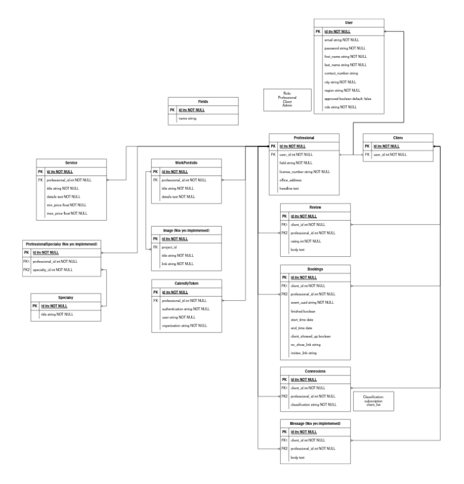

# Online Platform for Professionals

A simple application platform where clients can search and book appointments with professionals.

## Built with:
- Ruby 3.0
- Rails 6.1.5.1
- PostgreSQL 12.10


## Getting Started

These instructions will get you a copy of the project up and running on your local machine for development and testing purposes. See deployment for notes on how to deploy the project on a live system.

- Clone the repository and navigate to main app directory

	``` bash
	git clone https://github.com/gdperalta/online-platform-for-professionals-api.git
	cd online-platform-for-professionals-api
	```

- Install Rails API dependencies
	``` Ruby
		# For handling Cross-Origin Resource Sharing (CORS)
		gem 'rack-cors'
		# For user authentication
		gem 'devise', '~> 4.8.1'
		# For authorization token
		gem 'devise-jwt', '~> 0.9.0'
		# For json api format
		gem 'jsonapi-serializer', '~> 2.2.0'
		# For pagination
		gem 'pagy', '~> 5.10'
		# For user authorization
		gem 'pundit', '~> 2.2.0'
		# For searches
		gem 'ransack', '~> 3.0.1'
		# For request of external API
		gem 'rest-client', '~> 2.1.0'
		#For tests and development
		gem 'factory_bot_rails', '~> 6.2.0'
		gem 'rspec-rails', '~> 5.1.1'
		gem 'webmock', '~> 3.14.0'
	```

	Then run the command
	``` bash
		bundle install
	```
- Initialize the database
	``` bash
		rails db:create
		rails db:migrate
		rails db:seed
	```
- Run the server
	``` bash
		rails s
	```
## ERD


## Running the tests
Used [RSpec](https://rspec.info) for TDD
```bash
	rspec spec --format documentation
```

## Deployment

Add heroku remotes

Using [Heroku CLI](https://devcenter.heroku.com/articles/heroku-cli):

```bash
	heroku git:remote -a project
	heroku git:remote --remote heroku-staging -a project-staging
```
### With Heroku pipeline (recommended)

Push to Heroku staging remote:

```bash
	git push heroku-staging
```

Go to the Heroku Dashboard and [promote the app to production](https://devcenter.heroku.com/articles/pipelines) or use Heroku CLI:

```bash
	heroku pipelines:promote -a project-staging
```

### Directly to production (not recommended)

Push to Heroku production remote:

```bash
	git push heroku
```


## Environments
API Endpoints documentation: https://app.swaggerhub.com/apis/gdperalta924/OPPA/1

API Base URL: https://professional-platform-api.herokuapp.com/

Frontend repository: https://github.com/dwghdev/online-platform-for-professionals-frontend

Deployed app: https://online-platform-for-professionals-frontend.vercel.app/

Philippines Location API: https://ph-locations-api.buonzz.com/docs/

Calendly API: https://developer.calendly.com/api-docs/ZG9jOjQ1Mg-calendly-developer

## Authors
* Godfrey Peralta
* Dale Walter  
* Jerick Borela